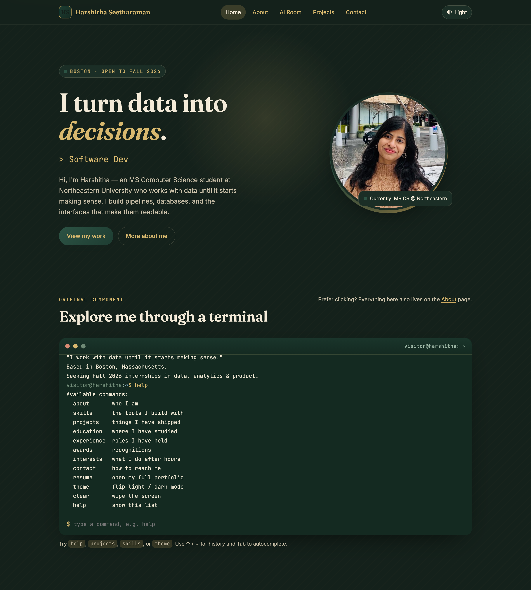

# Harshitha Seetharaman — Personal Homepage

A front-end-only personal homepage built with **vanilla HTML5, CSS3, and ES6
modules**. Its signature feature is an **interactive terminal** that lets visitors
explore my work by typing commands, wrapped in a warm "Reading Room" theme (deep
green, cream, walnut, and gold) with a persistent light/dark switch.

> _"I work with data until it starts making sense."_

---

## Author

**Harshitha Seetharaman**
MS in Computer Science, Northeastern University (Khoury College)
📧 seetharaman.ha@northeastern.edu · 🔗 [LinkedIn](https://www.linkedin.com/in/harshitha-seetharaman-97098a213/) · 🌐 [Portfolio](https://harshitha-seetharaman-portfolio.vercel.app/)

## Class Link

CS Web Development — Project 1: Personal Home Page
<!-- TODO: paste your Canvas course URL here before submitting -->

`<add your course/Canvas link here>`

## Project Objective

Build a memorable, standards-compliant personal homepage using only vanilla
HTML5, CSS3, and ES6 modules — no backend, no jQuery, no component libraries —
that clearly communicates who I am and what I build, includes an original
interactive component, and is deployed publicly. The full design rationale
(project description, user personas, user stories, and mockups) lives in
[`DESIGN.md`](./DESIGN.md).

## Screenshot



> If the image above is missing, open `index.html` and take a screenshot into
> `images/screenshot.png`.

## Features

- 🖥️ **Interactive terminal** (`js/terminal.js`) — type `help`, `about`,
  `projects`, `skills`, `contact`, `theme`, `clear`. Supports command history
  (↑/↓) and Tab autocompletion.
- 🎨 **"Reading Room" theme** with a persistent light/dark toggle (saved to
  `localStorage`, defaults to your OS preference).
- ✍️ **Typewriter role rotator**, scroll-reveal sections, a pointer-following
  glow, and a rotating portrait frame — all disabled under
  `prefers-reduced-motion`.
- 🤖 **AI Room page** (`ai.html`) — an AI-drafted reflection with a "compose
  again" generator and full transparency notes.
- ♿ Accessible: skip link, `alt` text on all images, `aria` labels, semantic
  HTML, real `<button>` elements.
- 📱 Responsive layout using CSS Grid **and** Flexbox.

## Pages

| Page    | File         | Description                                                    |
| ------- | ------------ | -------------------------------------------------------------- |
| Home    | `index.html` | Hero, terminal, projects, skills, contact                      |
| About   | `about.html` | Bio, education & experience timelines, achievements, interests |
| AI Room | `ai.html`    | AI-generated page with an interactive generator                |

## Tech Stack

- **HTML5** (semantic, W3C-valid)
- **CSS3** (custom properties, Grid + Flexbox, no `!important`)
- **JavaScript (ES6 modules)** — `type="module"` scripts and `"type": "module"`
  in `package.json`
- **Google Fonts** (Fraunces, Inter, JetBrains Mono)
- **Prettier** + **ESLint** for formatting and linting
- **Vercel** for deployment

## Project Structure

```
assign1/
├── index.html          # Home
├── about.html          # About (second URL)
├── ai.html             # AI-generated page (third URL)
├── css/
│   └── styles.css      # All styling (no !important)
├── js/
│   ├── data.js         # Shared content (single source of truth)
│   ├── terminal.js     # Interactive terminal component
│   ├── ui.js           # Theme, typewriter, reveal, pointer glow
│   ├── main.js         # Home entry point
│   ├── about.js        # About entry point
│   └── ai.js           # AI page entry point + generator
├── images/             # avatar, favicon, screenshot
├── DESIGN.md           # Design document (description, personas, stories, mockups)
├── package.json        # type: module + dependencies
├── eslint.config.js    # ESLint flat config
├── .prettierrc.json    # Prettier config
├── vercel.json         # Vercel config
├── LICENSE             # MIT
└── README.md
```

## Instructions to Build & Run

This is a static site — no build step is required.

**Option 1 — open directly**
Because the pages use ES6 modules (`type="module"`), browsers require the files
to be served over HTTP (opening via `file://` will block module loading). Use a
local server:

```bash
# From the assign1/ folder
npx serve .
# then open the printed URL (e.g. http://localhost:3000)
```

or

```bash
python3 -m http.server 8000
# then open http://localhost:8000
```

**Option 2 — with the dev tooling**

```bash
npm install          # installs Prettier + ESLint (dev only)
npm run lint         # ESLint — should report no errors
npm run format:check # Prettier — should report all files formatted
npm start            # serves the site locally
```

## Deployment (Vercel)

The site is deployed on Vercel as a static project.

```bash
npm i -g vercel      # once
vercel               # from assign1/ — follow the prompts
vercel --prod        # promote to production
```

Or connect the GitHub repo at [vercel.com](https://vercel.com) → **New Project**
→ import the repo → deploy (no framework preset needed; it's static).

## Use of Generative AI (GenAI)

This project used generative AI as a **drafting and pair-programming assistant**.
All output was reviewed, edited, and verified by me before inclusion.

| Tool            | Model / Version                 | How it was used                                                                                                                                       |
| --------------- | ------------------------------- | ----------------------------------------------------------------------------------------------------------------------------------------------------- |
| **Claude Code** | Claude **Opus 4.8** (Anthropic) | Scaffolding the file/folder structure, drafting the HTML/CSS/JS boilerplate, wiring the ES6 modules, and writing the design document and this README. |
| **Claude**      | Claude **Opus 4.8** (Anthropic) | Generating the short verse fragments used on the AI Room page (`ai.html`), which I then curated for tone and accuracy.                                |

**Representative prompts used:**

- _"Build a personal homepage in vanilla HTML5, CSS3, and ES6 modules with an
  interactive terminal component; use a royal warm 'interior' palette of deep
  green, beige/cream, and brown with a gold accent; make it motion-driven but
  accessible."_
- _"Write an ES6 module for an in-browser terminal that renders content from a
  shared data module and supports command history and Tab autocompletion."_
- _"Generate a few three-line poetic fragments (opening / middle / closing) that
  riff on the tagline 'I work with data until it starts making sense.'"_

**What was NOT AI-generated:** my personal information, projects, résumé content,
photograph, and the final decisions on design, wording, and what shipped. The
recombination logic in `js/ai.js` is original code; the AI only produced raw
fragments that I selected from.

## License

Released under the [MIT License](./LICENSE). © 2026 Harshitha Seetharaman.
